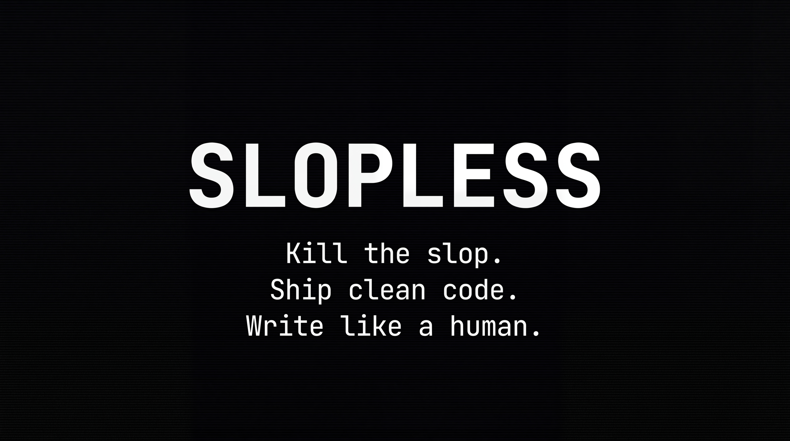

<p align="center">
  
</p>

<p align="center">
  <a href="https://github.com/BioInfo/slopless/stargazers"></a>
  <a href="https://github.com/BioInfo/slopless/network/members"></a>
  <a href="https://github.com/BioInfo/slopless/blob/main/LICENSE"></a>
  <a href="#"></a>
  <a href="#"></a>
  <a href="#"></a>
</p>

<p align="center">
  <a href="#quick-start">Quick Start</a> &bull;
  <a href="#whats-in-the-box">What's Included</a> &bull;
  <a href="#the-anti-slop-system">Anti-Slop System</a> &bull;
  <a href="#philosophy">Philosophy</a> &bull;
  <a href="#customization">Customization</a>
</p>

---

Drop-in `CLAUDE.md` and rules files that make Claude Code write cleaner code and text that doesn't read like it was written by a chatbot.

Built from 18 months of daily use across 50+ projects, 134 skills, and 8 autonomous agents. Every rule exists because Claude repeatedly made that specific mistake without it.

## Quick Start

**Global (all projects):**
```bash
git clone https://github.com/BioInfo/slopless.git
cp slopless/CLAUDE.md ~/.claude/CLAUDE.md
cp -r slopless/rules/ ~/.claude/rules/
```

**Per-project:**
```bash
cp slopless/CLAUDE.md ./CLAUDE.md
```

**One-liner:**
```bash
curl -fsSL https://raw.githubusercontent.com/BioInfo/slopless/main/CLAUDE.md > ~/.claude/CLAUDE.md
```

## What's in the box

```
CLAUDE.md                        # Core behavioral guidelines
rules/
  writing-voice.md               # Anti-AI-slop writing system (100+ banned patterns)
  subagent-models.md             # Model routing (haiku/sonnet/opus)
  quality-gates.md               # Verify before presenting
  security.md                    # Safety constraints
  operational.md                 # Port conflicts, error recovery
  data-processing.md             # Dedup, timestamps, batching
  recovery.md                    # Backup and recovery procedures
```

## The Anti-Slop System

The core of Slopless is `rules/writing-voice.md`. It's a comprehensive system that prevents AI-detectable writing patterns through three layers:

### Layer 1: Banned Words (100+)

Twelve categories of words and phrases that are statistically overrepresented in LLM output:

| Category | Examples |
|----------|----------|
| LLM-ism verbs | delve, leverage, harness, utilize, streamline, unlock |
| LLM-ism intensifiers | crucial, vital, paramount, groundbreaking, game-changing |
| Abstract/poetic | tapestry, labyrinth, journey, narrative, nuanced |
| Stock openings | "I hope this email finds you well", "Great question" |
| Hollow enthusiasm | "I'd be happy to", "resonated", "keeps me up at night" |
| Faux-depth closers | "food for thought", "worth sitting with" |
| Mechanical transitions | furthermore, moreover, additionally, consequently |
| Hollow emphasis | "is real", "the whole game", "are exactly" |
| Performed reactions | "stopped me cold", "hit me", "struck me" |
| Algorithmic scaffolding | "The short version:", "Here's why..." |
| Faux-precision hedges | "genuinely", "I truly think" |
| Reaching for metaphors | "useful lens", "sits at the intersection of" |

### Layer 2: Structural Anti-Patterns

Detectable AI writing structures that flag text as generated:

- **Forced contrasts** ("Not only X, but Y")
- **Rhetorical Q&A** ("So what does this mean? It means...")
- **Rule-of-three** (always listing exactly three things)
- **Uniform paragraph length** (every paragraph 3-4 sentences)
- **Paragraph-ending profundity** (dramatic upswings at paragraph ends)
- **Manufactured parallelism** (forced symmetry in consecutive sentences)

### Layer 3: Authenticity Rules

Research-backed techniques that make text indistinguishable from human writing:

- **Burstiness**: Mix sentences under 8 words with sentences over 20 words
- **Paragraph variance**: Range from 1 to 7 sentences, never uniform
- **Specificity**: Ground every assertion in a concrete detail (name, metric, date)
- **Lexical diversity**: Use unexpected but precise word choices ("brittle" not "fragile")
- **No reflexive Unicode**: Arrows and decorative bullets in prose are AI tells
- **Post-draft scan**: Mandatory checklist before presenting any output

## Coding Guidelines

The `CLAUDE.md` file prevents the most common Claude Code mistakes:

| Problem | Rule |
|---------|------|
| Adds features you didn't ask for | "Don't add features beyond what was asked" |
| Over-engineers simple tasks | "No abstractions for single-use code" |
| Adds defensive code for impossible cases | "Don't add error handling for scenarios that can't happen" |
| Touches unrelated code | "Every changed line should trace to the user's request" |
| States facts without checking | "Read files before stating facts about them" |
| Keeps going without verifying | "Diagnose why before switching tactics" |

## Model Routing

`rules/subagent-models.md` prevents a common gotcha: picking the wrong model for subagent tasks and getting silently truncated output.

| Model | Max Output | Best For |
|-------|-----------|----------|
| Haiku | 8,192 tokens | File search, monitoring, lookups |
| Sonnet | 16,384 tokens | Code generation, batch edits, analysis |
| Opus | 32,000 tokens | Architecture decisions, complex planning |

## Philosophy

**Rules over hope.** Don't hope Claude will write clean code. Tell it what clean means. Be specific about what to avoid.

**Banned patterns > positive examples.** "Don't use delve" is more effective than "write naturally." LLMs need negative constraints more than positive ones.

**Layer your config.** Global `~/.claude/CLAUDE.md` for universal rules. Per-project `CLAUDE.md` for project-specific patterns. `~/.claude/rules/` for behavioral files that auto-load every session.

**Verify, don't trust.** Claude will confidently state that a file contains something it doesn't. The quality gates force verification before presentation.

## Customization

The writing voice file is designed to be forked. The top section (voice pillars, register ladder, lexicon) is where you add your own style. The bottom section (banned words, anti-patterns, authenticity rules) is universal and should be kept as-is.

```
rules/writing-voice.md
  |
  |-- Voice (CUSTOMIZE) ---- Your style, your register, your patterns
  |-- Banned Words (KEEP) -- Universal LLM-ism detection
  |-- Anti-Patterns (KEEP) - Structural AI tells
  |-- Authenticity (KEEP) -- Research-backed human-pass rules
```

## Contributing

Found a word or pattern that should be banned? Open an issue or PR. The banned list grows through real-world corrections. If Claude keeps producing a phrase that reads as AI-generated, it belongs here.

## License

MIT

---

<p align="center">
  <sub>Built by <a href="https://x.com/BioInfo">@BioInfo</a>. Follow for more AI engineering content.</sub>
</p>
